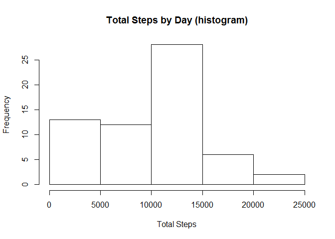
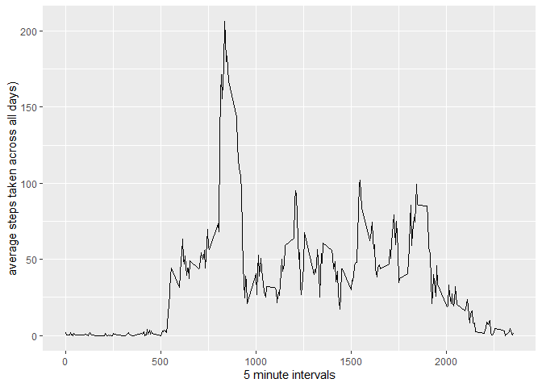
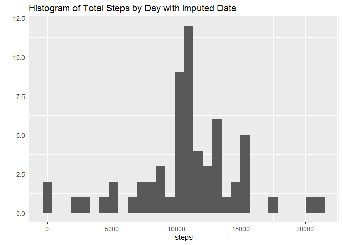
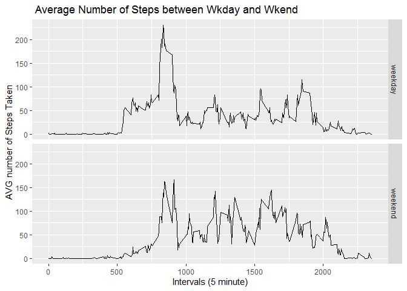

\#Hey guys this is my first R markdown document! Take a look at my work
below!

Part 1 - Loading and Processing the data.
-----------------------------------------

    download.file("https://d396qusza40orc.cloudfront.net/repdata%2Fdata%2Factivity.zip", destfile = "activitydata.zip") #downloads data from coursera provided link.
    unzip("activitydata.zip") #unzips the data in the zip file
    rawdata  <- read.table("activity.csv", sep = ",", header = TRUE) #since header is provided in the .csv file I've included it as true and denoted the seperator as a comma. (you can use read.csv as well)
    str(rawdata) #this will show you a some stats about the data.

    ## 'data.frame':    17568 obs. of  3 variables:
    ##  $ steps   : int  NA NA NA NA NA NA NA NA NA NA ...
    ##  $ date    : Factor w/ 61 levels "2012-10-01","2012-10-02",..: 1 1 1 1 1 1 1 1 1 1 ...
    ##  $ interval: int  0 5 10 15 20 25 30 35 40 45 ...

    library(ggplot2)
    library(dplyr)

    ## 
    ## Attaching package: 'dplyr'

    ## The following objects are masked from 'package:stats':
    ## 
    ##     filter, lag

    ## The following objects are masked from 'package:base':
    ## 
    ##     intersect, setdiff, setequal, union

    library(lubridate)

    ## 
    ## Attaching package: 'lubridate'

    ## The following objects are masked from 'package:dplyr':
    ## 
    ##     intersect, setdiff, union

    ## The following objects are masked from 'package:base':
    ## 
    ##     date, intersect, setdiff, union

You can see from the summary data above, that there are 17,568
observations under 3 variables. Not at this time that the dat is in
class “factor” format.

Part 2 - What is mean total number of steps taken per day?
----------------------------------------------------------

    totstepsbyday <- tapply(rawdata$steps, rawdata$date, sum, na.rm = TRUE) #outputs a list/array of values while ignoring NA values
    hist(totstepsbyday,bins= 100, main = "Total Steps by Day (histogram)", xlab = "Total Steps") #outputs the frequency of total steps by day

    ## Warning in plot.window(xlim, ylim, "", ...): "bins" is not a graphical parameter

    ## Warning in title(main = main, sub = sub, xlab = xlab, ylab = ylab, ...): "bins"
    ## is not a graphical parameter

    ## Warning in axis(1, ...): "bins" is not a graphical parameter

    ## Warning in axis(2, ...): "bins" is not a graphical parameter

    print(c("The mean of the total steps is:",mean(totstepsbyday),"The Median of the total steps is:", median(totstepsbyday)))

    ## [1] "The mean of the total steps is:"   "9354.22950819672"                 
    ## [3] "The Median of the total steps is:" "10395"

Part 3 - What is the average daily activity pattern?
----------------------------------------------------

    avgactivity <- rawdata %>% group_by(interval) %>% summarize(avgstep = mean(steps,na.rm=TRUE))  #calcuates total steps taken at each inverval across all days
    qplot(interval, avgstep, data = avgactivity, geom = "line", xlab = "5 minute intervals", ylab = "average steps taken across all days)")

    highestinterval<- avgactivity[which.max(avgactivity$avgstep),1]
    print(c("highest average step occurs in interval:", highestinterval))

    ## [[1]]
    ## [1] "highest average step occurs in interval:"
    ## 
    ## $interval
    ## [1] 835

Part 4 - Imputing missing values & recaluculate missing days
------------------------------------------------------------

    misvalues <- rawdata[is.na(rawdata),] #subsets the missingvalues data.
    print(c(nrow(misvalues), "rows of missing data"))

    ## [1] "2304"                 "rows of missing data"

    imputedata <- merge(rawdata, avgactivity)  #means data was calculated in last step - I can re use the data per interval here.
    imputedata$steps[is.na(imputedata$steps)] <- imputedata$avgstep[is.na(imputedata$steps)]
    dataforhits <- group_by(imputedata, date) %>% summarize(steps = sum(steps))
    qplot(steps, data = dataforhits, main = "Histogram of Total Steps by Day with Imputed Data")

    ## `stat_bin()` using `bins = 30`. Pick better value with `binwidth`.

    print(c("The mean total steps/day is", mean(dataforhits$steps)," The median total steps/day is", median(dataforhits$steps)))

    ## [1] "The mean total steps/day is"    "10766.1886792453"              
    ## [3] " The median total steps/day is" "10766.1886792453"

Part 5 - Differences in weekdays vs weekends!
---------------------------------------------

    imputedata$date <- ymd(imputedata$date)  
    weekdaydata <- mutate(imputedata, whichday = weekdays(imputedata$date))
    weekdaydata <- mutate(weekdaydata, weekend =  as.factor(ifelse(weekdaydata$whichday == "Saturday" | weekdaydata$whichday == "Sunday","weekend", "weekday")))
    meansteps <- weekdaydata %>% group_by(interval,weekend) %>%   summarise(average = mean(steps))
    qplot(interval, average, data = meansteps, facets = weekend~., geom = "line", main = " Average Number of Steps between Wkday and Wkend", xlab = "Intervals (5 minute)", ylab = "AVG number of Steps Taken")

